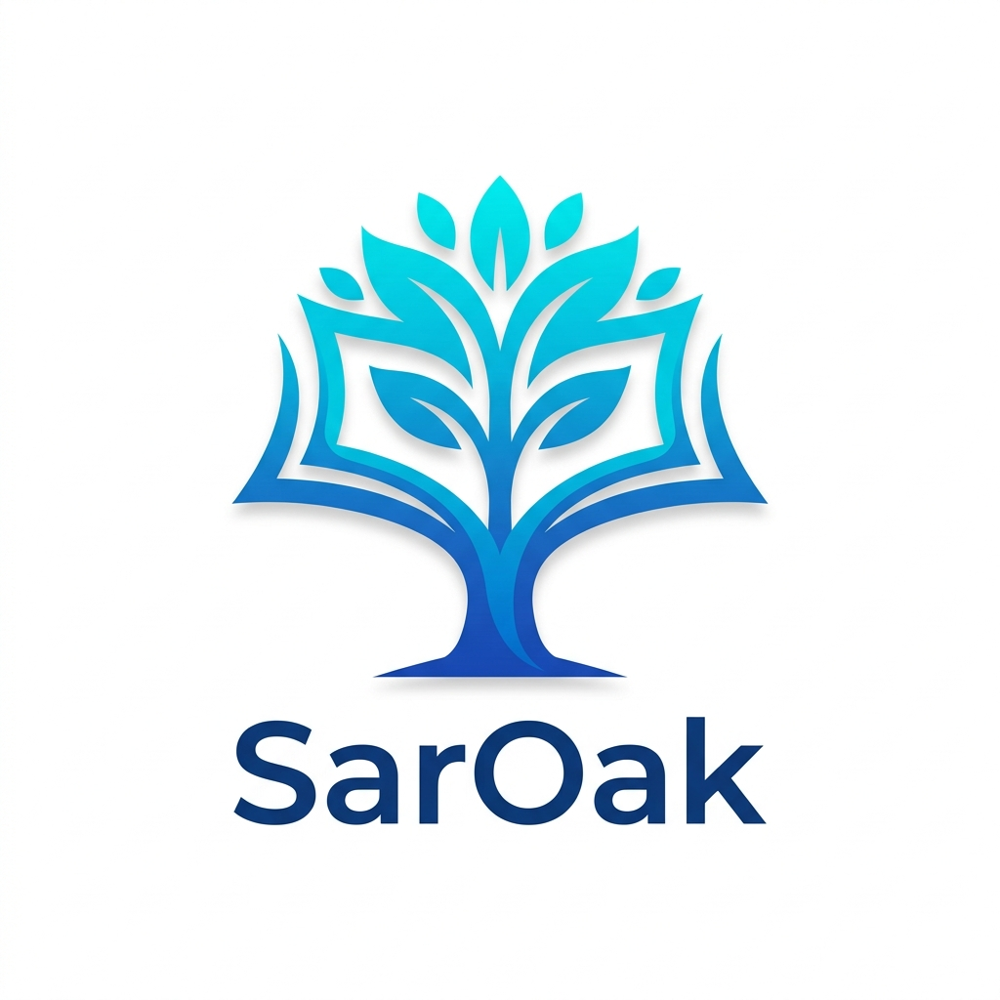

<div align="center">
  
</div>

# SarOak — Myanmar Digital Library 📚

SarOak is a fast, beautiful, and open-source digital library built to preserve and distribute Myanmar literature in the digital age. 

## ✨ Features

- **Bilingual Interface**: Seamlessly switch between English and Myanmar languages with custom typography settings to ensure perfect Burmese font rendering without clipping.
- **Smart Book Importing**: Have a folder full of books? A custom Node script parses file names and automatically groups multiple ebook formats (EPUB, KFX, AZW3) for the same title into a unified catalog entry!
- **Beautiful UI/UX**: Built with a sleek, responsive CSS Grid layout, a modern flat aesthetic, and full Light/Dark mode support.
- **Instant Client-Side Filtering**: Search, sort, and filter through the entire book collection instantly. Pagination ensures the UI stays snappy even with 1,000+ books.
- **Zero Server Overhead**: The entire frontend is static. You can host this for free on Cloudflare Pages or GitHub Pages!

## 🚀 Local Development

1. **Install dependencies:**
   ```bash
   npm install
   ```
2. **Start the development server:**
   ```bash
   npm run dev
   ```
3. **Build for production:**
   ```bash
   npm run build
   ```

## 📖 Importing Books
If you have a local directory of ebooks you'd like to import into the library:
1. Drop your `.epub`, `.azw3`, or `.pdf` files into the `/public/books/` folder.
2. Run `npm run sync:books`.
3. The script will automatically clean the author names, intelligently assign AI categories, and update the `books-data.js` database! (Note: This also runs automatically before every build).

## 🤝 Contributing
Contributions are welcome! Feel free to open issues, submit pull requests, or share more open-source Myanmar literature to add to the library.

---
*Made with ❤️ for Myanmar readers.*
